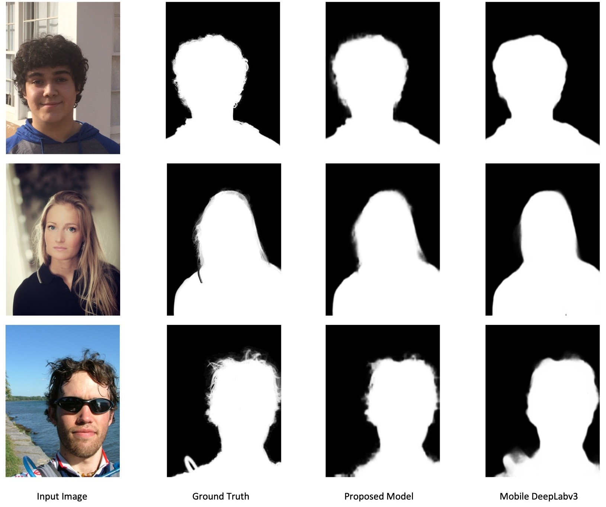

I am a computer vision algorithm engineer work at [Juphoon System Software](https://www.juphoon.com/en/).
Previously, I graduated from Conell University with a master's degree in Electrical Engineering. Even before that, I was an undergraduate student at Purdue University.

My research interests focus on image and video understanding, and the intersections of vision and other fields 
(eg. language and voices).

Please find my CV [here](assets/docs/about/CV_KeyuanZhang.pdf)

## Selected Projects
1. **Real-time Communication with Virtual Background**

[Web Demo](https://kz.42.github.io/virtual_background/) [Report](docs/virtual_background/virtual_background.pdf)

I demonstrated a model to replace the background in real-time video communication by tackling the problem of portrait matting on mobile devices. The proposed model solves issues of previous models and achieves real-time inference speed while maintaining high visual performance. The proposed feature can attain over 25 FPS on 720P on iPhone11 in real-time video communication. 

{: style="width:100%;"}

2. **Real-time Face Detection and Facial Landmark**

todo

Besides research, I enjoy photography, cooking, and fitness.
