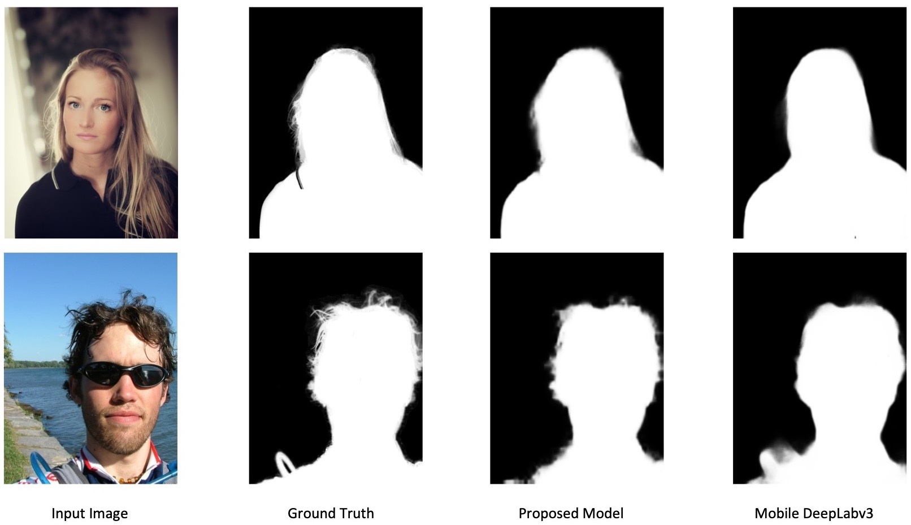

I am a computer vision algorithm engineer work at [Juphoon System Software](https://www.juphoon.com/en/). Previously, I graduated from Conell University with a master's degree in Electrical Engineering. Even before that, I was an undergraduate student at Purdue University.

My research focuses on computer vision and the intersection of vision and other fields (language and sound). In particular, I aim to leverage these to better understand complex human activities through multiple senses. I am also interested in video understanding, human activity recognition, and video enhancement.
{: style="text-align: justify;"}

Besides research, I enjoy photography, cooking, and fitness.

Please find my CV [here](assets/docs/about/CV_KeyuanZhang.pdf)

Selected Projects
----------------------

**1. Real-time Communication with Virtual Background** [[Doc](assets/docs/virtual_background/virtual_background.pdf){: .small__tt}] [[Web Demo](https://kz42.github.io/projects/virtual_background/){: .small__tt}] [[Real-time Virtual Background Video Demo](assets/videos/virtual_bkg.MP4){: .small__tt}] [[Real-time Blur Background Video Demo](assets/videos/blur_bkg.MP4){: .small__tt}]

I demonstrated a model to replace the background in real-time video communication by tackling the problem of portrait matting on mobile devices. The proposed model solves issues of previous models and achieves real-time inference speed while maintaining high visual performance. The Virtual background feature can attain over 25 FPS on 720P on iPhone11 in real-time video communication.

I've uploaded two video demos for real-time background editing using the proposed model.

{: style="width:100%;"}

**2. Real-time Face Detection and Facial Landmark** [[Doc](assets/docs/face/face.pdf){: .small__tt}] [[Video Demo](assets/videos/face.MP4){: .small__tt}]

Face detector and facial landmark is fundamental to other advanced tasks,for example, face recognition, liveness detection, and face editing. In this project, I will show how to integrate the two open-source works to build a high-performance facial landmark detector, the improvements, and modifications Ihave made for each work. The integrated model can achieve over 24FPS on iPhone X.

{: style="width:100%;"}

